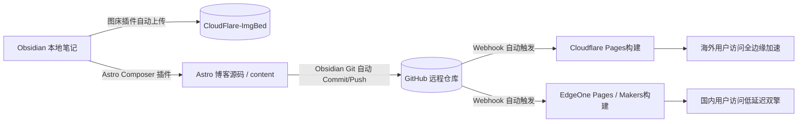

对于喜欢记录和分享的人来说，搭建个人博客往往是一个“始于内容、陷于折腾”的过程。从最早的 WordPress 到后来的 Hexo、Hugo，再到现代的 Astro，每一次框架的迭代都能带来极速的访问体验，但同时也带来了一套繁重的写作流程：

* 打开终端敲命令创建 Markdown 文件
* 手动在 Frontmatter 中复制粘贴元数据
* 处理复杂的相对图片路径或手动上传图床
* 写入完成后通过终端手动提交 Git，等待平台构建……

长此以往，本该轻松的写作变成了充满心理负担的“任务”，许多灵感最终死在了草稿箱里。

为了打破这种尴尬，我重新设计并搭建了一套**“博客即笔记，笔记即博客”**的全自动流转方案。核心目标只有一个：**让写作重回无压力状态，在本地 Obsidian 里写完即发布**。

---

## 🗺️ 全景架构流转图

这套工作流的底层逻辑非常明确：**以 Obsidian 为核心写作中心，利用自动化插件完成内容转换与媒体上传，后台通过 Git 自动无感同步，最后在 Cloudflare Pages 与腾讯云 EdgeOne 边缘双节点实现无缝自动构建。**

---

## 🛠️ 核心组件与配置细节

### 1. 写作体验：Obsidian 本地双链知识库
将 Obsidian 作为博文的唯一创作入口。你可以享受到原生 Markdown 渲染、大纲导航、标签管理以及全盘双链的丝滑体验。最关键的是，你不再需要切换到 IDE 或终端去编辑文件。

---

### 2. 媒体托管：自动上传图床解绑仓库体积
在静态博客的构建中，将大尺寸图片直接打包存放在 Git 仓库里是极大的负担。

* **工具选择**：Obsidian 图床插件（如 `Image Auto Upload` 配合 PicGo 核心 / S3 / R2 API）。
* **工作流程**：在 Obsidian 中粘贴或拖拽图片时，插件会在后台自动把图片上传至图床，并在文章中直接替换为绝对 `https://` 图片 URL。
* **收益**：避免增量同步卡顿，不仅极大瘦身了 Git 仓库体积，也解决了静态博客构建时令人头疼的本地相对图片路径报错问题。

---

### 3. 内容衔接：Astro Composer 自动转换博文
Astro 强大的 Content Collections 机制要求文件具有规范的前言（Frontmatter）和固定的文件存放路径。每次手动配置十分繁琐。

* **自动化转化**：通过 Obsidian 中的 **Astro Composer** 插件（或定制化导出脚本），可以在 Obsidian 侧边栏/快捷键一键将当前选中的笔记转换为符合 Astro 项目规范的博文。
* **Frontmatter 映射**：自动补充 `title`, `published`, `description`, `tags`, `category`, `pinned` 等元数据。
* **路径路由自动化**：文章会自动输出并覆盖到本地博客源码项目的 `src/content/posts/` 路径下，实现“笔记”到“博客源码”的零复制粘贴衔接。

---

### 4. 版本控制：Obsidian Git 无感自动化备份
为了摆脱“写完文章必须打开终端输入 `git add . && git commit -m "..." && git push` ”的机械动作：

* **插件安装**：Obsidian 社区插件 **Obsidian Git**。
* **自动化策略**：
  * 设置定时自动 Commit & Push（例如每 15 分钟后台无感同步一次）。
  * 配置启动时自动拉取（`Pull on startup`），保证多设备写作时的状态同步。
* **效果**：你在写笔记的同时，提交动作已经在后台隐形完成，你的最新内容也已安全送达 GitHub 仓库。

---

## 🚀 双重边缘部署：EdgeOne Pages + Cloudflare Pages

有了完整的 GitHub 代码与内容仓库，部署层只需全权交给现代化 Edge 平台的自动化 CI/CD。

为了兼顾国内外的访问速度与极致可用性，我选择了**“Cloudflare Pages + 腾讯云 EdgeOne Pages (Makers)”** 的双边缘架构：

1. **GitHub 自动化关联**：在 Cloudflare Pages 和 EdgeOne Pages 后台绑定 GitHub 博客仓库，并将构建命令设置为 `npm run build` (或 `pnpm build`)，输出目录设置为 `dist`。
2. **多边缘自动抓取**：无论是提交了一篇新博文，还是改动了一个错别字，GitHub 收到推送后会立即向 Cloudflare 和 EdgeOne 发送 webhook。
3. **极速镜像构建**：
   * **Cloudflare Pages**：部署在 CF 强大的全球边缘网络，为海外用户提供秒级的加载体验。
   * **EdgeOne Pages (Makers)**：依靠腾讯云 EdgeOne 节点，为国内用户提供极致低延迟的边缘网络响应与加速。

---

## 💡 总结与心得

通过将 **Obsidian + 图床 + Astro Composer + Obsidian Git + 边缘 Pages 双重部署** 这几个环节打通，我成功把“博客的运维”变成了“单纯的笔记写作”。

现在的写作流程非常自然：
打开 Obsidian ✍️ -> 随手撰写并插入图片 🖼️ -> 点击一键转化为博客 ⚡ -> 关闭软件离开 ☕。

后续的存储、备份、构建、全球 CDN 分发全由后台自动化管线无感处理。折腾的终点始终是回归内容本身，希望这套流程能给同样想搭博客又怕折腾的同学带来启发。

