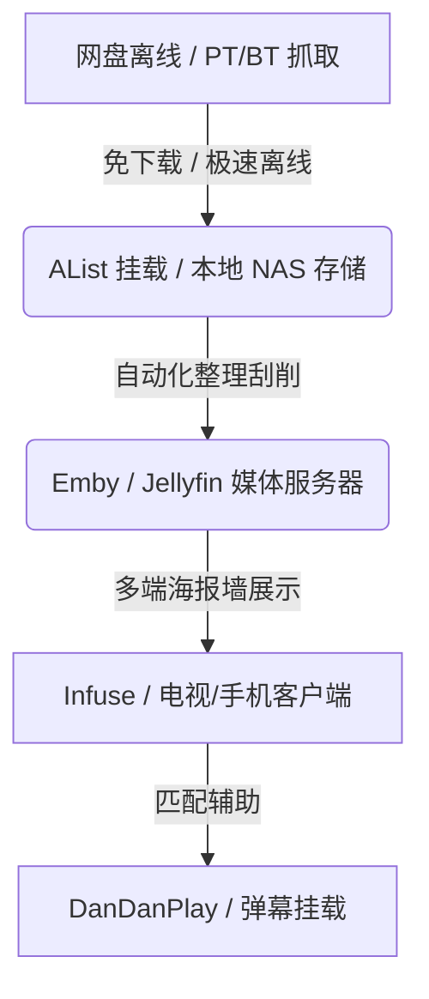

在 4G/5G 与百兆光纤全面普及的今天，“点开即看”已经成了绝大多数人观看影视剧的默认习惯。爱奇艺、腾讯视频、BiliBili、Netflix、Disney+ 等在线流媒体平台凭着开箱即用的极致便捷，迅速吞噬了绝大部分用户的观影时间。

在很多人的印象里，需要寻找种子、复制磁力链接、焦急等待下载进度条的 **BT（BitTorrent）下载**，似乎早已是属于“上个时代”的落伍技术。

然而，一个有趣的现象是：在各类科技社区、NAS 论坛以及影音发烧友圈子里，BT 资源（以及衍生出的 PT 私有种子站）不仅没有走向灭亡，反而成为了极客们乐此不疲的硬核玩法。

**BT 下载在今天真的过时了吗？比起便捷的在线流媒体，BT 资源观影究竟有何不可替代的优势，又有哪些显而易见的短板？** 本文将带你深入剖析这两种观影模式的终极对决。

> **免责声明**：本文仅做技术原理交流、影音软件生态与个人数字资产管理探讨，请支持正版影视作品，遵守相关法律法规。

---

## 一、 深度较量：BT 资源观影 vs 在线流媒体

在线平台主打“省心”，而 BT 资源追求“极致”。为了更清晰地呈现两者的本质差异，我们先从关键维度做一个全景对比：

| 评价维度 | 商业在线流媒体平台 | BT / PT 私人影音资源 |
| :--- | :--- | :--- |
| **视频码率** | 极低（所谓的 4K 码率通常仅 8 ~ 15 Mbps） | 顶级（4K Remux / 蓝光原盘码率高达 50 ~ 90+ Mbps） |
| **音频质量** | 有损 AAC / 双声道 / 低码率 5.1 压缩音轨 | 物理原盘无损次世代音轨（Dolby TrueHD Atmos / DTS-HD MA） |
| **广告与干扰** | 60~120s 片头广告、VIP 专属中插、暂停弹窗 | **绝对零广告**，点击即入片头，纯净影院级沉浸 |
| **画面完整性** | 存在镜头裁剪、遮挡打码、片段删减、画面放大 | 原汁原味（包含未删减版、导演剪辑版、加长版等） |
| **画面动态** | 算法压制，暗部噪点多，HDR 效果平淡 | 原生杜比视界 (Dolby Vision) / HDR10+ / 高色深细腻呈现 |
| **数字掌控** | 版权到期随时下架，需订阅多平台会员 | 个人私有化永久归档，随时回看，绝不下架 |
| **网络依赖性** | 极度依赖实时外网带宽，高峰期容易降码降阶 | 本地/局域网高码率播放，零缓冲绝对流畅 |
| **使用门槛** | 极低（App 即点即看） | 较高（需学习检索、下载、存储刮削与硬件解压配置） |

---

### 1. 画质与码率：虚假的 4K vs 真实的蓝光物理极值

在探讨画质时，很多非技术专业用户容易掉入“分辨率陷阱”——以为只要写着“4K”或者“1080P Ultra”就是清晰。

事实上，**决定画质上限的真正核心在于“码率”（Bitrate）**。

- **流媒体的“码率刀法”**：CDN 流量带宽是流媒体平台极其庞大的成本支出。为了降低运营开销，即便是 Netflix 或爱优腾的 4K 档位，视频码率通常也被严格限制在 **8 ~ 15 Mbps** 左右。高压缩率直接导致色彩断层、暗部呈现大量块状噪点、运动画面出现模糊失真。
- **BT 资源的原生还原**：在 BT 社区，无论是无损提取的 `REMUX` 还是蓝光原盘 `BD-ISO`，码率往往高达 **50 ~ 90+ Mbps**。画面中的织物纹理、发丝细节、夜景暗部层次，都维持了摄影器材捕捉到的原始水准，配合杜比视界（Dolby Vision）或 HDR10+，能彻底发挥高清电视与投影仪的物理性能。

```
[流媒体 4K 压缩流]   ---> 8-15 Mbps  ---> 牺牲细节/暗部噪点/色彩断层
[BT 4K Remux 原码]  ---> 50-90 Mbps ---> 极致色彩/清晰细节/高动态保留
```

---

### 2. 声音的艺术：压缩音轨 vs 震撼的无损全景声

好电影不仅是看出来的，更是“听”出来的。

商业在线平台出于设备兼容性与带宽考虑，绝大多数影片仅提供有损压缩的双声道 AAC 音轨，即使标榜 5.1/7.1，也是经过重重压制后的 E-AC3 编码。

而在 BT 资源中，你可以轻而易举地下载到保留了原生 **Dolby TrueHD Atmos（杜比全景声）** 或 **DTS-HD Master Audio** 的顶级音轨。当你拥有一套独立的家庭影院音响或优质耳机时，BT 资源带来的物体定位感、头顶上方声道与震撼低音，是流媒体完全无法比拟的。

---

### 3. 告别广告侵扰：零打扰的纯净沉浸 vs 无孔不入的商业变现

如今在商业流媒体平台看一部电影，用户往往需要经历层层广告的“洗礼”：

- **花式广告植入**：从打开 App 时的开屏广告，到动辄 60~120 秒的片头广告；
- **付费后的“专属广告”**：即便买了 VIP 会员，依然有避不开的“VIP 特供预告片”、“中插剧场广告”、甚至按下暂停键时突然占满屏幕的浮动广告弹窗；
- **TV 端的重重限制**：电视端 APP 往往还需要额外购买更贵的“大屏会员”，投屏还可能遭到降码率或屏蔽。

而使用 BT 资源观影，体验是**完全纯净与自主的**。点击播放按钮，画面便直接切入片头字幕，没有倒计时、没有横幅广告、没有被中途打断的焦虑。这种零打扰的纯粹性，才是私家影院应有的沉浸感。

---

### 4. 内容的纯粹度：被割裂的流媒体 vs 原汁原味的影音

使用流媒体观影时，观众常常不得不面对“不完整的内容体验”：

- **删减与修饰**：因审查政策或播放时段限制，部分影片会被阉割删减剧情片段、画面被局部放大避开敏感部位、甚至加上突兀的遮挡元素。
- **字幕劣化与圣光**：许多进口动漫或影视在流媒体平台上线时，字幕会遭到低幼化修改或模糊处理。

相反，通过 BT 资源，你可以获取到**未删减版（Unrated）**、**导演剪辑版（Director's Cut）**、**扩展加长版（Extended Edition）**。搭配字幕组精心制作的富文本 ASS 特效字幕，能还原主创团队最原始、最纯粹的艺术表达。

---

### 5. 数字资产所有权：随时下架的“临时租赁” vs 永久私有云

在在线流媒体时代，你支付的月费或年费，本质上购买的只是**针对特定影片的“临时观看权限”**。

- 随着版权协议到期，许多经典剧集可能一夜之间全网消失；
- 版权方可能因为商业竞争，将某部作品的后续几季拆分到另一个完全不常用的全新平台上，逼迫用户重复开通会员；
- 甚至有时候，平台为了迎合新的流行趋势，会对老片进行重新剪辑或替换配乐。

而将 BT 资源存储在自己的移动硬盘、NAS（网络附加存储）或私有云盘中，作品就真正变成了你的**私人数字资产**。无论时代如何变迁、版权归属如何纷争，只要硬盘没坏，你随时随地都能重温经典。

---

### 6. 体验与门槛：零门槛便携 vs 动手折腾与硬件开销

当然，客观来说，BT 资源观影也绝非毫无缺点。对比在线流媒体，BT 的主要劣势在于：

1. **学习与实践门槛**：需要理解磁力链（Magnet）、种子（Torrent）、做种分享率（Ratio）、视频编码（H.265/AV1）、字幕重命名等概念。
2. **硬件与资金投入**：要享受极致的 BT 影音体验，往往需要额外的硬件成本——更大容量的硬盘/NAS、支持硬解 HDR/杜比视界的播放终端（如 Apple TV / 电视盒）、以及配套的优质音响。
3. **响应时间延误**：遇到冷门旧资源时，如果缺少种子连接，可能需要等待很长时间，无法做到在线平台“即点即放”的快感。

---

## 二、 重新定义 BT：现代技术如何消除 BT 的传统弊端？

许多人以为 BT 观影依然停留在“用电脑开下载软件跑一夜，再用本地播放器打开”的原始阶段。其实，结合现代化的软件生态，BT 观影早已进化得极其流畅与优雅：



1. **解决“下载慢/死链”**：利用 115网盘 / PikPak / 阿里云盘 的离线中转功能，将磁力链接瞬间转换为云端文件；再通过 [AList](https://alist.nn.ci/) 工具挂载，实现免下载直接在线播放 4K 蓝光原盘。
2. **解决“文件乱/缺乏海报墙”**：部署 **Emby / Jellyfin / Plex** 媒体服务器，配合 `MoviePilot` 或 `Sonarr` 等自动化刮削工具，BT 资源也能瞬间变成比 Netflix 还要精致华丽的个人影院海报墙。
3. **解决“缺乏弹幕与互动”**：通过 **弹弹play (DanDanPlay)** 或 Emby 弹幕扩展插件，算法能自动识别 BT 文件的哈希值，并将全网的实时弹幕实时挂载到高清片源上，兼顾了二次元互动氛围与最高画质。

---

## 三、 总结：BT 没有过时，它只是进化成了极客掌控数字自由的基石

回到最初的问题：**BT 下载在今天真的过时了吗？**

答案显然是否定的。

在线流媒体确实接管了绝大多数普通用户“随便看看”的碎片化娱乐需求，但这并不意味着 BT 的落幕。相反，BT / PT 已经从一种“普及型下载工具”，升维成了影音爱好者、科技发烧友以及数字资产收藏者**抵御画质降级、摆脱广告侵扰、逃离版权焦虑、追寻绝对视听自由的核心基石**。

当你真正体验过 80Mbps 码率配合杜比全景声带来的震撼，建立起属于自己的零广告未删减精刮海报墙时，你就会明白：BT 并没有过时，它只是以更强大的形态，活在每一个追求极致体验的数字玩家手中。