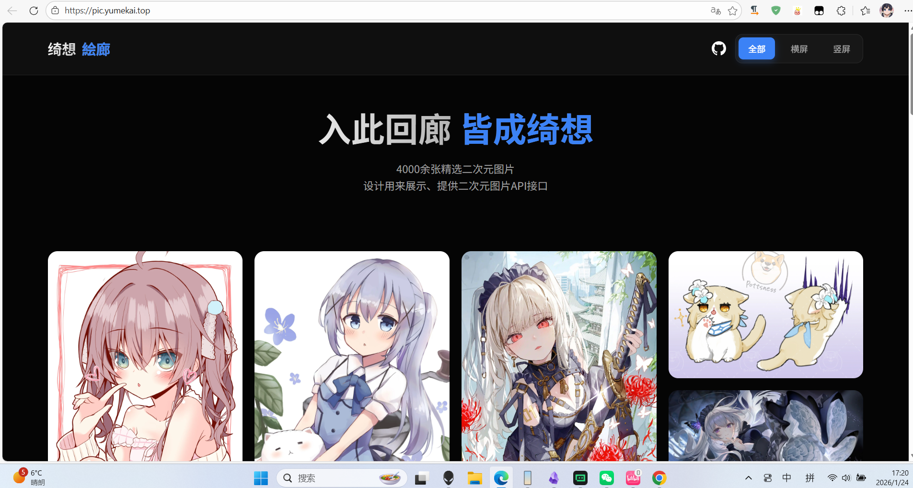

# 项目功能
- 提供随机图片重定向服务。

- 支持根据 User-Agent 自动返回适配设备的图片（横屏/竖屏）。



# 项目地址
  ::github{repo="YUME-0721/PicAPI-Gallery"}
## 免费使用

静态图片画廊 - 绮想絵廊 [https://pic.yumekai.top](https://pic.yumekai.top/) (个人自用，不保证稳定，点个star谢谢！)

# 📚 API 使用指南
  
项目包含一个 EdgeOne Functions (`functions/pic.js`)，提供以下 HTTP GET 接口：

| 参数 | 描述 | 示例 |
|------|------|------|
| `?img=h` | 获取一张随机的**横屏**图片 (PC壁纸) | `/` 或 `/?img=h` |
| `?img=v` | 获取一张随机的**竖屏**图片 (手机壁纸) | `/?img=v` |
| `?img=ua` | 根据访问设备自动返回适配图片 (手机返回竖屏，PC返回横屏) | `/?img=ua` 

# ✨ 页面特性 (Features)

*   **沉浸式画廊体验**:

    *   **瀑布流布局**: 使用 CSS Multi-column 技术，完美兼容各种比例的横屏与竖屏图片。

    *   **无限滚动**: 自动感知滚动到底部并加载更多图片，提供流畅的浏览体验。

    *   **高级暗色主题**: 采用 Glassmorphism（毛玻璃）设计风格，提供电影级的视觉享受。

    *   **智能导航**: 导航栏随滚动自动隐藏/显示，最大化内容展示区域。

    *   **即时筛选**: 支持在无刷新情况下切换“全部”、“横屏”、“竖屏”视图。

    *   **灯箱模式**: 点击图片即可全屏查看高清大图。

# 📂 项目结构

```

EdgeOne_PicAPI/

├── index.html            # 画廊主页 (入口文件)
├── assets/
│   ├── css/
│   │   └── style.css     # 全局样式 & 响应式布局
│   └── js/
│       └── app.js        # 前端逻辑 (无限加载、混洗、筛选)
├── functions/
│   └── pic.js            # EdgeOne 边缘函数 (API逻辑)
└── ri/                   # 图片资源目录
    ├── h/                # 横屏图片 (.webp)
    └── v/                # 竖屏图片 (.webp)
```


# 🚀 部署 (Deployment)


本项目专为 **Tencent EdgeOne Pages** 设计。


1.  将代码推送到 Git 仓库。

2.  在 EdgeOne Pages 控制台新建项目。

3.  关联 Git 仓库。

4.  **构建配置**:

    *   **构建目录 (Build Directory)**: 保持默认或设置为 `/` (项目根目录)。

    *   无需特殊的构建命令 (这是一个静态站点)。

5.  点击部署。

# 🛠 开发 (Development)

## 本地预览

如果你安装了 Node.js，可以使用 `serve` 或 `http-server` 快速启动本地预览：

  
```bash

npx serve .

```

访问 `http://localhost:3000` 即可查看画廊效果。

# 注意：

## 图片范围配置:

目前代码硬编码了图片数量 (在 `assets/js/app.js` 和 `functions/pic.js` 中):

- 横屏 (Horizontal): 1 - 882

- 竖屏 (Vertical): 1 - 3289

若添加新图片，请确保更新这两个文件中的 `maxHorizontalImageNumber` 和 `maxVerticalImageNumber` 常量。
