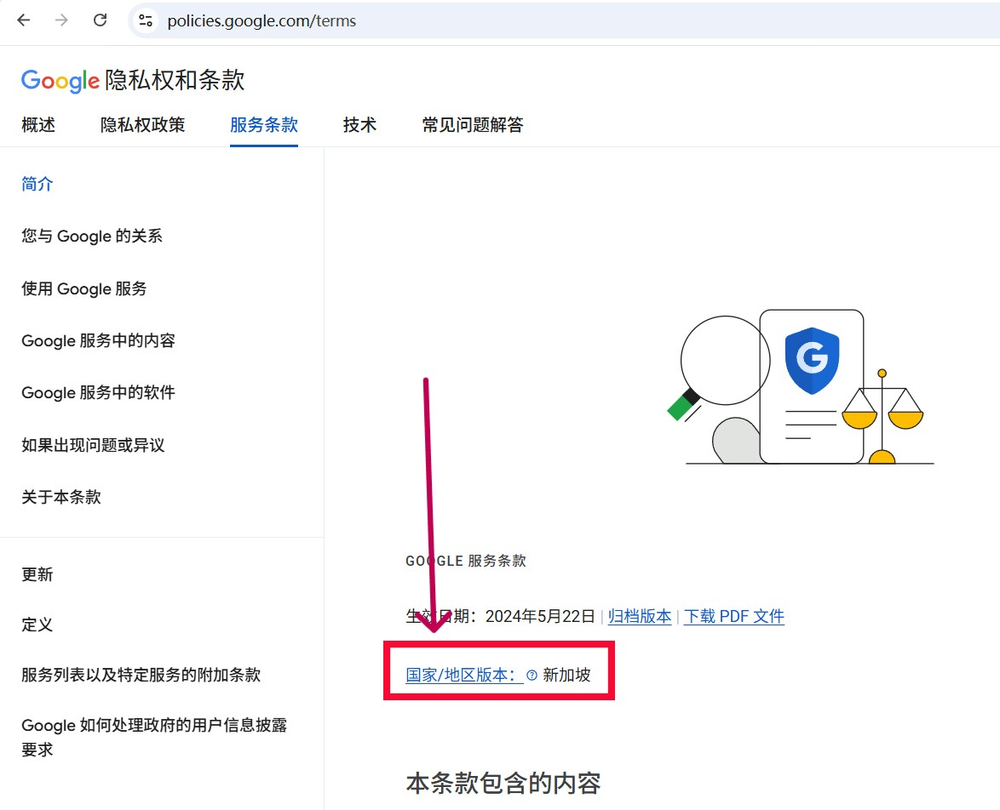
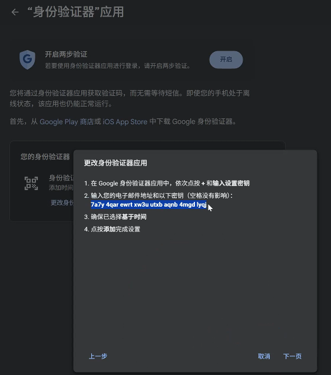
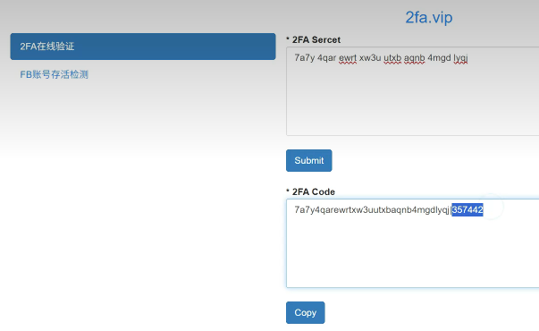
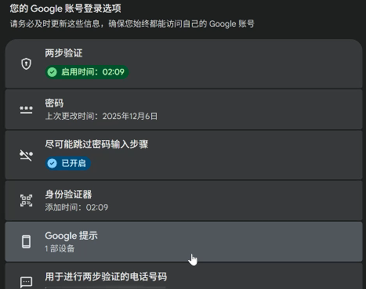
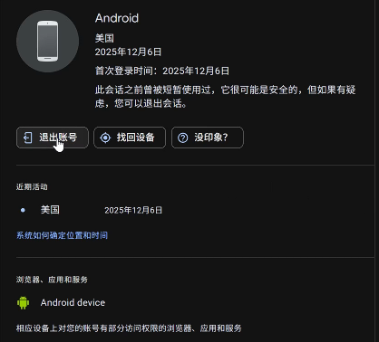
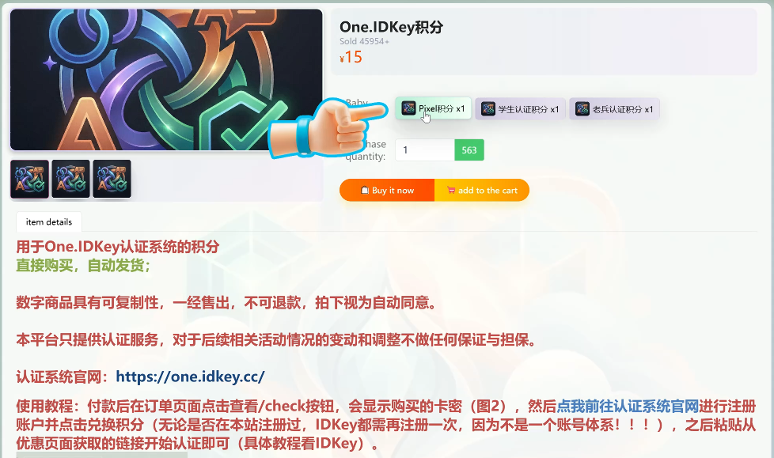
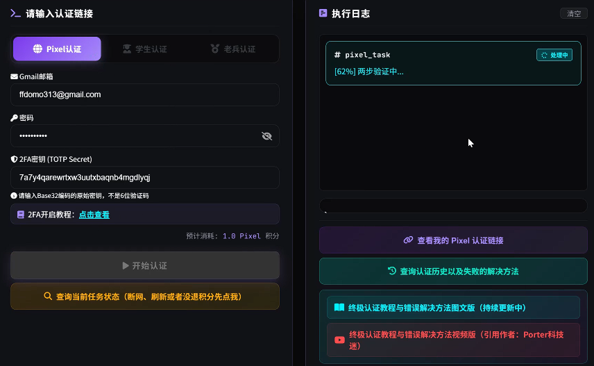

## 🎯 活动概述

Google为Pixel用户推出的专属福利：**免费12个月Google AI Pro（Gemini Pro）会员资格**！这个活动让Pixel设备持有者能够免费体验Google最先进的AI助手服务，价值数百美元。

## 📱 资格要求

### 账号要求
- 新/老账号，只要正常能登陆就可以
- 之前无法通过学生资格认证的账号
- 用学生资格获取优惠被查到并收回的账号
- 已用学生资格获取一年优惠的账号（享受优惠时间不能叠加，会重新计算优惠期）

### 地区限制
- 只有部分地区才可以领到12个月完整优惠，需对照活动详情页核对设备所在地区是否符合要求（https://support.google.com/gemini/answer/13529884）
- 例如：我的账号地区是新加坡（查看地区前往 https://policies.google.com/terms ）

## 🌍 地区设置调整

如果遇到地区限制问题，可以通过以下官方渠道修改Google账号的服务地区：

**Google账号地区关联表单：**
https://policies.google.com/country-association-form
地区换成新加坡或者其他符合要求的，提交后需要等待几个小时才会生效（成功会有邮件提醒）。

## 🔍 官方规则验证

### 资格验证工具
**One.IDKey认证站：**
https://one.idkey.cc/?ref=parkway

使用该工具网站可以快速验证你的设备和网络是否符合活动资格要求（一定要使用纯净IP的稳定网络代理）。

## 📋 实测步骤详解

### 第一步：账号准备
1. 浏览器登录你的Google账号
2. 点击头像进入”管理您的Google账号”页面
3. 点击进入“安全性与登录”，点击进入“身份验证器”，如果之前有点击“更改身份验证器应用”，没有则添加，出现二维码后点击下方的“无法扫描”
4. 复制密钥到2FA验证网站，点击Submit活动返回密钥和6位验证码（主用验证器：https://2fa.vip ，备用地址： https://2fa.kennygmail.com ）

5. 将6位验证码输入到Goole进行验证，点击上方的开启两步验证
6. 点击“Goolge提示”，点击“管理设备”，退出已登陆的手机

### 第二步：资格验证
1. 访问One.IDKey认证站（ https://one.idkey.cc/?ref=parkway ）
2. 完成注册登陆
3. 不想花钱可以签到100天或者拉人获得积分，也可以花15元直接获得积分（页面下滑找到“购买积分”，在新网站完成注册登录后点击购买“One.IDKey积分”，成功后复制密钥返回One.IDKey”兑换积分“）

4. 在Pixel认证页面按要求填写 Google账号、Google密码，2FA密钥（如图，在第一步的4.中获得的密钥）

5. 点击”开始认证“，网络纯净稳定的就成功了，不行的请检查账号密码，切换稳定的代理

## 💡 使用体验与功能

激活成功后，你将获得：

### Gemini Pro核心功能
- **高级AI对话能力**：更智能、更准确的回答
- **多模态支持**：文本、图像、代码等多种格式
- **长文本处理**：处理更长的文档和对话
- **优先访问**：新功能的优先体验权

### 实用场景
- 编程辅助与代码调试
- 文档撰写与编辑
- 学习与研究支持
- 创意内容生成

---

**总结：** 这个Pixel专属的Google AI Pro会员活动为Pixel用户提供了极佳的AI体验机会。通过本文的实测方案，你可以顺利激活并充分利用这12个月的免费会员资格。记得在享受AI便利的同时，也要注意账号安全和合规使用。

*本文基于2026年4月的活动信息，具体细节请以Google官方最新公告为准。*