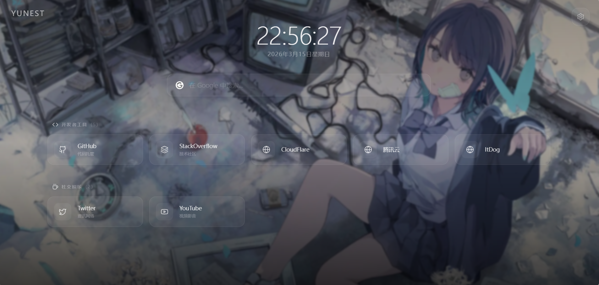

## 项目介绍

YuNest 是一个现代、美观且高度可定制的个人静态导航与书签管理工具。作为一个纯前端应用，它可以轻松部署在任何静态托管服务上，为你提供一个个性化的网络入口。



## 项目地址
  ::github{repo="YUME-0721/YuNest"}
有用的话，点个start就非常感谢了！

## 核心功能

### 🎨 美观的设计风格
- 采用毛玻璃（Glassmorphism）与弥散光风格设计
- 丝滑流畅的入场及悬浮微动效
- 极简而不失质感的界面

### 🖼️ 强大的壁纸管理
- 支持纯色背景（可自由调色）
- 支持固定静态图片
- 支持随机图片 API
- 支持本地图片上传
- 可开启/关闭"玻璃拟态模糊"与"深色遮罩"

### 🔍 多引擎搜索集成
- 搜索栏自带引擎切换功能（Google、Bing、百度等）
- 支持在个性化设置中调整默认搜索引擎

### 🔖 便捷的书签管理
- 强大的内置分类和书签管理器
- 书签图标支持自动获取站点 Favicon
- 支持直接输入图片链接或使用 Lucide 主题图标

### 🔐 安全的后台认证
- 系统自带密码认证的管理后台
- 可通过环境变量定制访问密码

### 💾 数据管理
- 所有书签、偏好设置完全基于浏览器的 `localStorage` 实现
- 内置 JSON 数据的备份与还原功能
- 支持 GitHub 仓库同步，实现跨设备数据迁移

### 🚀 零依赖部署
- 采用 `HashRouter` 设计完美适配静态托管平台
- 可一键部署至 Cloudflare Pages、Vercel 及 GitHub Pages

## 技术实现

### 技术栈
- **框架**: React 18
- **语言**: TypeScript
- **构建工具**: Vite
- **样式**: Tailwind CSS v4
- **路由**: React Router (HashRouter)
- **图标集**: Lucide React

### 核心架构

#### 数据管理
YuNest 使用 React Context API 实现全局状态管理，所有数据通过 localStorage 持久化：

```typescript
// 核心数据结构
export interface AppState {
  settings: Settings;
  categories: Category[];
}

// 数据持久化
try {
  const parsed = JSON.parse(saved);
  return {
    ...defaultState,
    ...parsed,
    settings: { ...defaultState.settings, ...parsed.settings },
  };
} catch (e) {
  console.error('Failed to parse saved data', e);
}
```

#### GitHub 同步功能
通过 GitHub API 实现数据的云端备份与恢复：

```typescript
const syncToRepo = useCallback(async (tokenOverride?: string, repoOverride?: string) => {
  const token = tokenOverride || state.settings.githubToken;
  const repo = repoOverride || state.settings.githubRepo;
  if (!token || !repo) throw new Error('缺少 GitHub Token 或 仓库名');

  // 剔除敏感信息
  const stateToSave = { 
    ...state, 
    settings: { ...state.settings, githubToken: '', githubRepo: '' } 
  };

  // 执行 GitHub API 请求
  // ...
}, [state]);
```

#### 响应式设计
采用 Tailwind CSS 实现响应式布局，适配不同设备尺寸：

```tsx
<div className="grid grid-cols-1 sm:grid-cols-2 md:grid-cols-3 lg:grid-cols-4 xl:grid-cols-5 gap-4">
  {category.bookmarks.map((bookmark) => (
    <a
      key={bookmark.id}
      href={bookmark.url}
      target="_blank"
      rel="noopener noreferrer"
      className="flex items-center p-4 rounded-2xl glass hover:bg-white/10 hover:-translate-y-0.5 hover:border-white/15 transition-all duration-300 group"
    >
      {/* 书签内容 */}
    </a>
  ))}
</div>
```

## 部署指南

### 1. 本地运行

```bash
# 克隆代码仓库
git clone <your-repo-url>
cd YuNest

# 安装依赖
npm install

# 配置认证密码（可选）
cp .env.example .env
# 编辑 .env 文件，修改 VITE_ADMIN_PASSWORD 值

# 构建生产版本
npm run build

# 启动开发服务
npm run dev
```

### 2. 云平台部署

可一键部署到以下平台：
- **Cloudflare Pages / Vercel / Netlify/EdgeOne等:
  - `Build Command`: `npm run build`
  - `Output Directory`: `dist`
  - 需在平台设置中添加 `VITE_ADMIN_PASSWORD` 环境变量

## 使用指南

1. **访问首页**: 部署完成后访问站点，即可看到美观的导航界面

2. **进入后台**: 点击右上角的"齿轮"图标，输入管理员密码（默认为 `123456`）

3. **个性化配置**:
   - 修改站点名称
   - 更改默认搜索引擎
   - 管理壁纸和视觉效果

4. **管理书签**:
   - 添加/编辑/删除书签分类
   - 添加/编辑/删除书签
   - 调整书签顺序

5. **开启云端同步**:
   - 前往"备份与还原"页面
   - 配置 GitHub Token 和仓库信息
   - 点击"同步到云端"即可

6. **跨设备同步**:
   - 在其他设备上打开 YuNest
   - 进入"备份与还原"页面
   - 填写相同的 GitHub Token 和仓库信息
   - 点击"从云端拉取"即可

## 结语

如果有问题和建议，欢迎评论区留言或者提issue，非常感谢！

---
