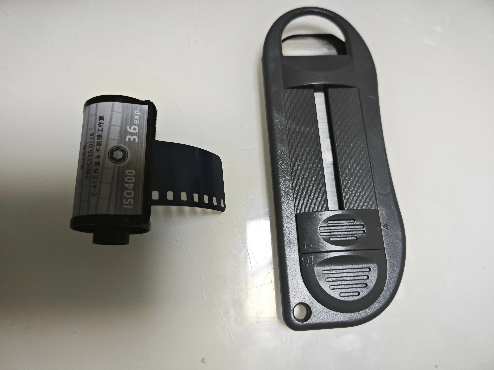

# 准备阶段
## 取片头

> 使用取片器取出片头，并剪成平的

## 暗袋上卷

# 水洗阶段
> 20度的水清洗一分钟即可（去除胶片上的防光晕涂层）

# 首显阶段
1. 加入20度的D76显影液，震荡消除气泡（防止胶片边缘起白边）。
2. 第一分钟持续搅拌或者摇晃，后面每一分钟搅拌20秒左右。
3. 乐凯旧款SHD400，首显时间为13分钟。
4. 倒出显影液，清水冲洗。

# 漂白阶段（从此开始可以见光）

1. 使用高锰酸钾漂白液，漂白至几乎胶片看不到图像
> 时间千万不能过长！1分钟左右就行，太长会脱膜成透明报废卷！
2. 倒出漂白液，清水冲洗。
3. 倒入焦亚硫酸钠溶液，彻底中和高锰酸钾，2分钟后00（底片呈现黄黄的状态）倒出，清水冲洗。

# 二次曝光阶段
1. 从片轴上取下胶卷，曝光在灯光下（家里浴霸灯就行）
2. 整卷照射3分钟左右，直至图像完全出来， 宁过勿欠。

# 二次显影阶段
1. 导入显影液（首显阶段用的就行，不用重新配）
2. 显影3-5分钟，期间间隔摇晃
3. 看到图像清晰，取出清水冲洗。
4. 倒入定影液，1分钟后倒出，清水冲洗，挂起晾干。

