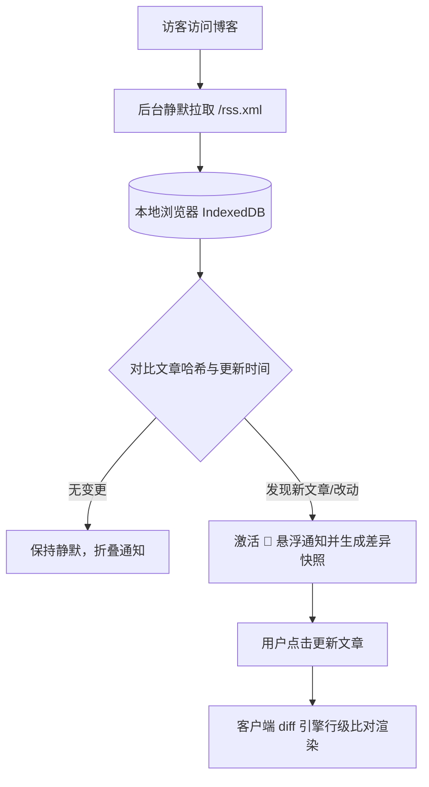

## 📌 什么是新文章通知与 Diff 对比？

在阅读技术博客与教程时，文章随着技术演进而更新修正（如修复配置命令、更新软件版本、优化架构图等）是常态。然而传统的静态博客中，读者往往无法感知文章改动了哪些具体细节。

为了给读者带来极致的阅读体验，本站自主研发并集成了**新文章智能提醒** 与 **文章版本差异对比(Post Diff)** 系统：

* **零登录与纯本地化**：利用浏览器本地 **IndexedDB** 与 **RSS 同步**，无须用户注册或登录，无需服务器存储追踪个人数据。
* **增量变更感知**：每次访问博客，自动比对上次阅读状态，智能标记新增与更新文章。
* **代码级精确高亮**：对改动文章自动渲染行级差异对比（绿色新增、红色删除、折叠不变内容），快速捕获内容迭代。

---

## 💡 核心功能亮点

### 1. 🔔 悬浮更新提醒
位于页面右下角的浮动通知气泡（移动端居右下），在检测到博主发布新内容或修改既有文章时，会呈现红色高亮呼吸点并弹出提醒窗口。

### 2. 🏷️ 智能状态标识
* 更新：代表该文章已存在于您的本地缓存，但博主近期对正文内容、命令或配置进行了编辑。
* 新文章：代表自您上次访问以来全新发布的博文。

### 3. 🔍 行级差异可视化（Diff 视图）
点击带有「更新」标识的文章后，页面将自动载入并激活 **Diff 差异模式**：
* 🟩 **绿色高亮背景**：博主新增或扩充的段落、代码行与配置。
* 🟥 **红色删除线/折叠区**：已过时、被修正或移除的旧内容。
* 🪟 **智能上下文折叠**：自动折叠未变更的大段文本，仅聚焦修改点前后数行。

### 4. 🧭 悬浮差异导航栏
进入对比模式后，页面底部将浮现专属控制条：
* 🔼 **上一处变更** / 🔽 **下一处变更**：平滑滚动直达修改位置。
* ❌ **退出对比**：一键切换回纯净的标准阅读模式。

---

## 📖 食用方法

### 第一步：查看与展开更新面板
1. 点击右下角的 **🔔 铃铛图标**，即可展开「发现新文章」通知窗口。
2. 窗口顶部会展示本次更新检测的时间跨度（例如：`2026/8/31 17:42:54 - 2026/8/31 23:38:50`）。
3. 可以在列表中浏览所有处于更新或新发布状态的文章列表。

### 第二步：进入文章与查看差异
* **查看新文章**：直接点击标题即可进入文章进行沉浸式阅读。
* **查看更新详情**：点击带有 **「更新」** 徽章的文章，页面将自动携带 `?diff=1#post-diff` 参数进入，并自动在正文中高亮呈现博主修改的前后差异。

### 第三步：使用底部差异导航条
在差异高亮模式下：
1. 页面底部中央会常驻 **差异导航条**。
2. 点击 **「上一处」/「下一处」** 按钮，页面会自动平滑锚定至各修改区块。
3. 点击 **「退出对比」** 按钮，页面即刻恢复至常规文章渲染视图。

### 第四步：清空通知与标记已读
* 点击通知窗口右上角的 🗑️ **垃圾桶图标**，即可清空当前累积的更新队列，并将当前时间戳作为下一次检查的基准起点。
* 点击通知窗口右上角的 ✕ **关闭按钮**、**点击窗口外部任意区域** 或按下键盘 **`Esc` 键**，均可平滑收起通知面板。

---

## ⚙️ 底层原理与隐私安全

1. **本地私有存储**：所有比对数据均存储在读者本地浏览器的 `IndexedDB (fuwari-rss-store)` 与 `LocalStorage` 中，无需联网上传任何阅读记录。
2. **高效轻量**：采用客户端增量差异计算算法，毫秒级比对数万字长文，不占用服务器算力。

---

## ❓ 常见问题（FAQ）

#### Q1：为什么我点击有些文章没有显示绿色/红色的差异对比？
> **答**：只有当您此前曾经访问缓存过该文章的旧版本，且博主随后发布了新修改时，系统才能生成新旧版本的对比差异。若是首次访问该文章（新文章），则会直接展示最新完整内容。

#### Q2：如果我想手动重置所有文章状态怎么办？
> **答**：打开通知面板，点击右上角 🗑️「清空通知」按钮，即可重置基准时间。或者在浏览器中按 `F12` 打开开发者工具，清除本地存储的 `fuwari-rss-store` IndexedDB 数据库。

#### Q3：无痕模式（Incognito）下可以使用此功能吗？
> **答**：可以正常使用！无痕模式下浏览器同样支持 IndexedDB，单次会话内的更新追踪依然有效；关闭无痕窗口后浏览器将自动清理本地数据。
