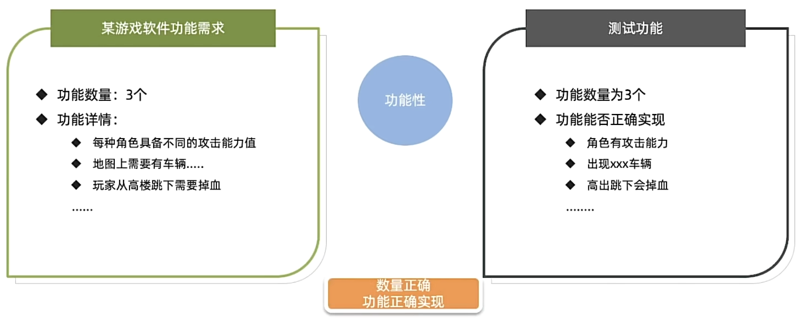
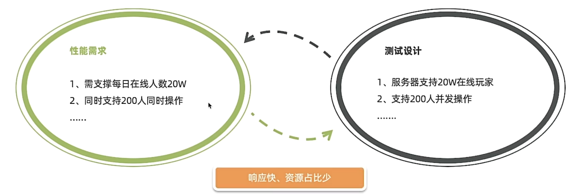
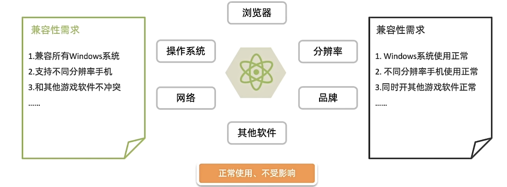
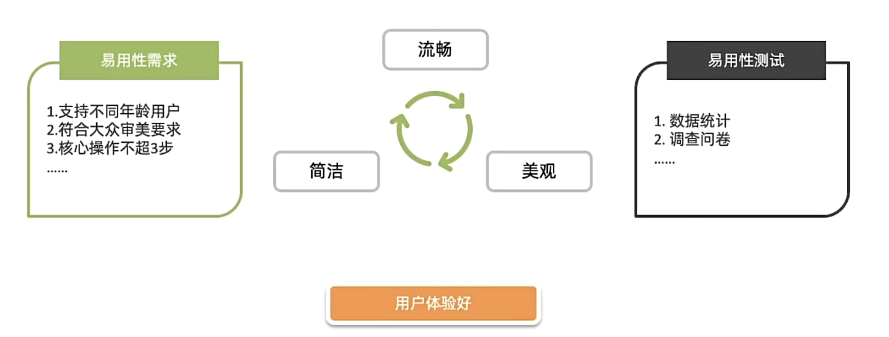
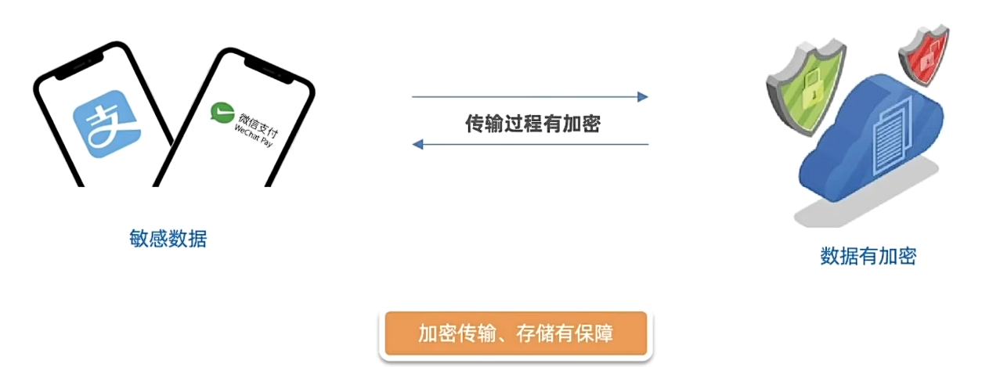
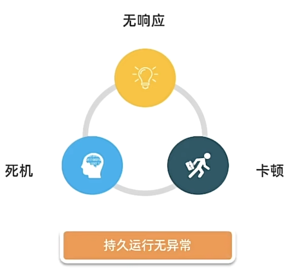
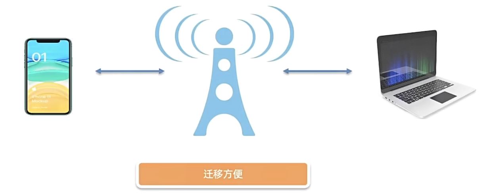
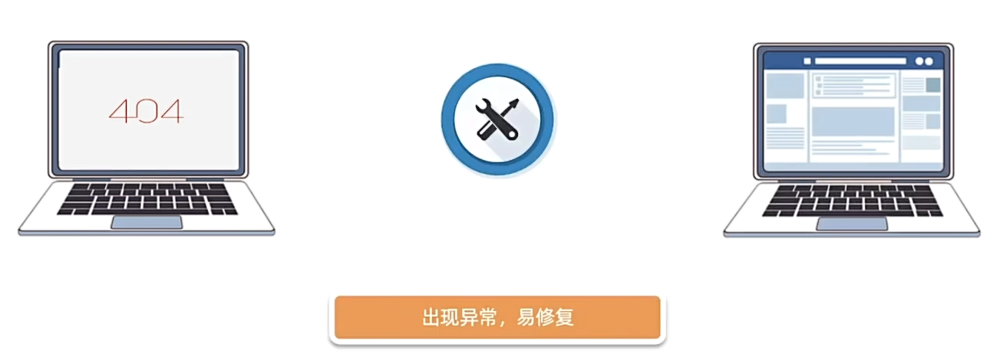

# 测试分类：
## 按照软件产生的阶段划分：
### 单元测试
开发人员自己编写代码时进行的基本测试，确保每个单元模块工作正常。

### 集成测试
验证不同模块组合在一起时能否正常工作，又称组装测试

### 系统测试
对整个软件系统层面（功能、非功能）进行全面测试，确保系统的全面性和一致性。

### 验收测试
由用户或独立测试团队执行，验证系统是否符合预期的业务需求

## 按照代码可见度划分：

### 黑盒测试
不关注源代码，针对有UI界面软件系统输入输出类测试
### 灰盒测试
针对无UI界面软件系统输入输出和内部逻辑结构的测试（能看到部分源代码）
### 白盒测试
针对源代码及内部逻辑本身进行测试
## 其他测试：
### 冒烟测试
- 概念：冒烟测试是对核心功能的验证。
- 作用：保障提测内容具备可测性

### 回归测试
- 概念：回归测试是对已修复Bug/更新后对已测内容进行再次测试
- 作用：保证Bug修复、确保新功能对旧功能没有影响

# 质量模型
软件质量模型是衡量一个软件质量的维度。
- 功能性：软件是否具备某个方面的能力。

- 性能：多用户同时使用能否满足要求（时间、资源）。

- 兼容性：在不同的设备/平台上能否正常使用。

- 易用性：易学、易用、用户粘性好。

- 安全性：敏感数据存储/传输安全。

- 可靠性：长时间运行稳定，不出现异常。

- 可移植性：应用系统升级/数据迁移方便

- 可维护性：运行过程出现问题维护操作是否方便。

