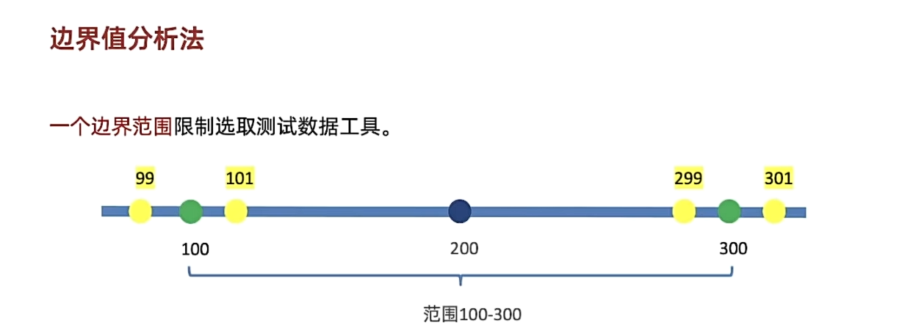

# 单功能
软件程序或应用程序只提供一项核心功能或特性，而不包含其他附加功能。如电商系统：

## 需求分析

分析：
1. 账号：已注册手机号、已注册邮箱、为空、未注册手机号（电信、移动、联通）和邮箱是否都要覆盖？
2. 密码：注册密码、为空、错误密码（写纯数字还是纯字母）？
3. 验证码：正确、过期、错误
## 等价类划分
一种用少量数据获得较好测试效果的工具。
<strong>场景</strong>：表单类页面元素测试使用（输入框、下拉框、单选框、复选框）等。

<strong>步骤：</strong>
1. 划分有效等价类：满足需求的数据集合。
2. 划分无效等价类：不满足需求的数据集合。
3. 每类中选取代表数据。

## 边界值分析法

- <strong>选取：</strong>
	1. 上点：刚好是边界上的点，必选（不考虑是否包含上点）100、300
	2. 离点：距离上点最近的点，选择2个（不包含上点选择范围内的点，包含上点选择范围外的点）99、301
	3. 内点：边界范围内的任意点，必选（建议选择中间范围）200
- <strong>步骤：</strong>
	1. 边界值分析（负责测试长度范围）
	2. 划分等价类（负责测试类型和规则）
	3. 提取数据

# 非功能测试
非功能：除了软件功能测试，其他都是非功能测试。

## 非功能测试范围：
- 兼容性
- 易用性
- 安全性
- 性能
- 可移植性
- 可维护性
- 可靠性

## 非功能重点测试项
- 兼容性：Web项目测试浏览器兼容Chrome、Edge、FireFox、Safari等
- 易用性：参考竞品，主观感受为主