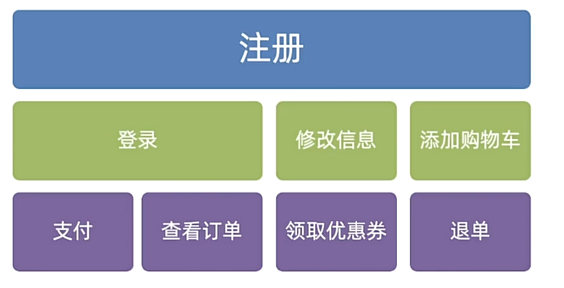
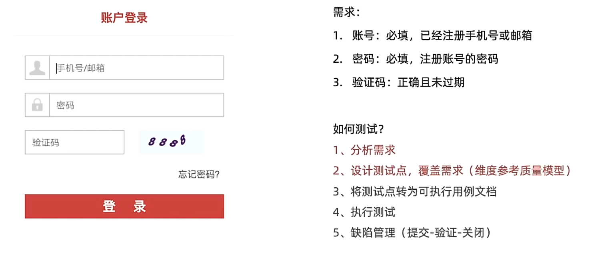
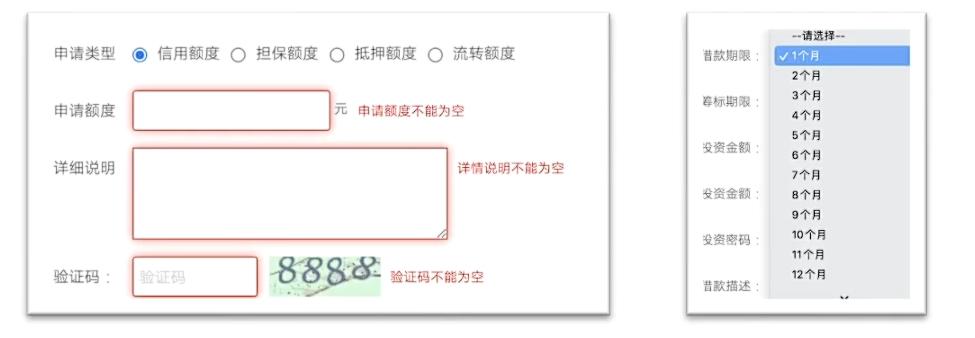
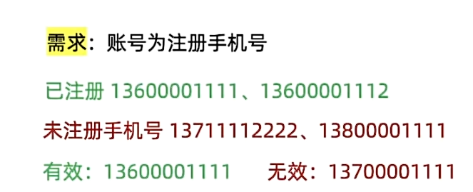

# 单功能
软件程序或应用程序只提供一项核心功能或特性，而不包含其他附加功能。如电商系统：

# 需求分析

分析：
1. 账号：已注册手机号、已注册邮箱、为空、未注册手机号（电信、移动、联通）和邮箱是否都要覆盖？
2. 密码：注册密码、为空、错误密码（写纯数字还是纯字母）？
3. 验证码：正确、过期、错误
## 等价类划分
一种用少量数据获得较好测试效果的工具。
<strong>场景</strong>：表单类页面元素测试使用（输入框、下拉框、单选框、复选框）等。

<strong>步骤：</strong>
1. 划分有效等价类：满足需求的数据集合。
2. 划分无效等价类：不满足需求的数据集合。
3. 每类中选取代表数据。

