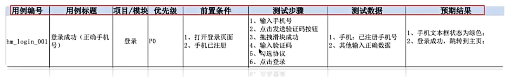

# 测试用例

## 介绍
测试用例：描述测试点执行的文档（测试输入、执行条件、预期结果等）

## 作用
1. 测试点能够被精准的执行
2. 便于团队协作

## 核心内容

- ：预期执行结果（测试点）
- 
- 优先级
- 前置条件
- 测试步骤
- 测试数据
- 预期结果

| 测试用例要素 | 格式要求 | 示例 |
| :--- | :--- | :--- |
| **用例编号** | 项目\_模块\_数字 | Hmtt_login_001 |
| **用例标题** | 预期执行结果（测试点） | 登录失败（密码为空） |
| **所属模块** | 模块名 | 登录 |
| **优先级** | 用例的重要程度（高P0~P3低） | P1 |
| **前置条件** | 执行操作步骤的前置条件 | 1.账号已注册 2.已打开登录页面 |
| **测试步骤** | 测试点执行的关键步骤 | 1.输入账号 2.输入密码 3，点击登陆按钮 |
| **测试数据** | 输入数据 | 1.账号：已注册手机号 2.密码：空 3.点击登录按钮 |
| **预期结果** | 预期执行结果 | 登录失败，提示：密码不可为空，请正确输入注册账号密码 |